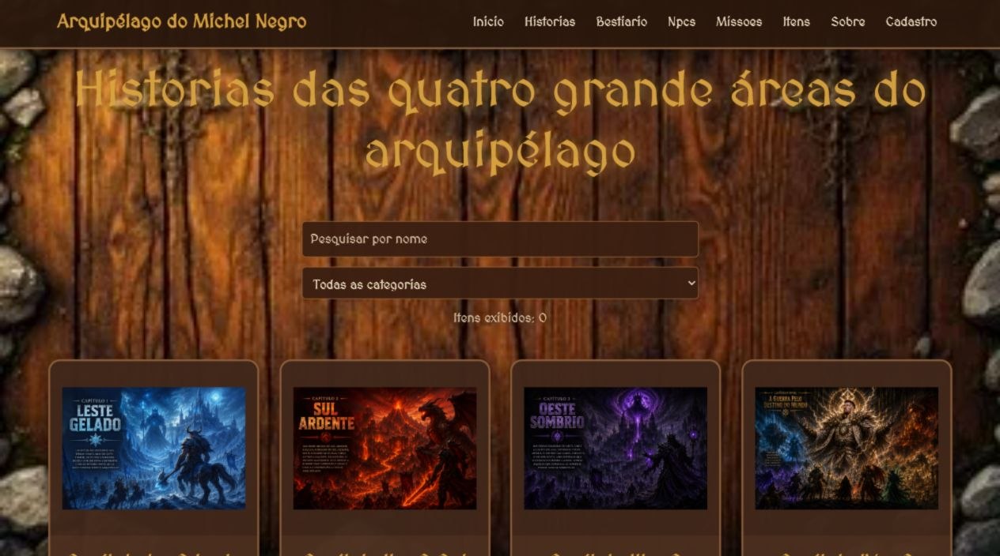
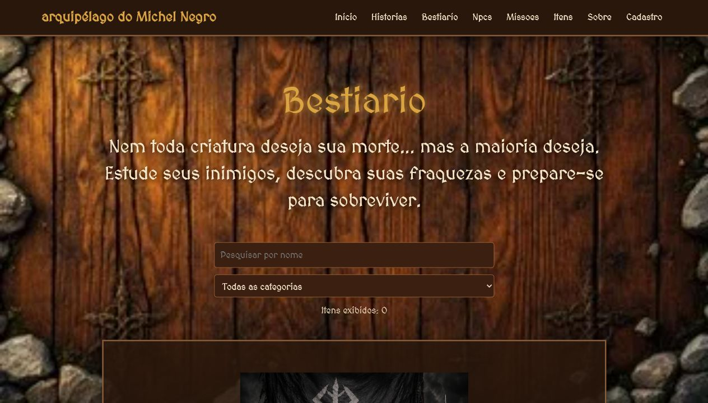
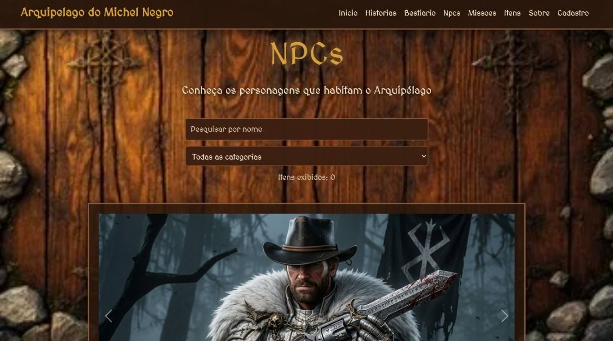
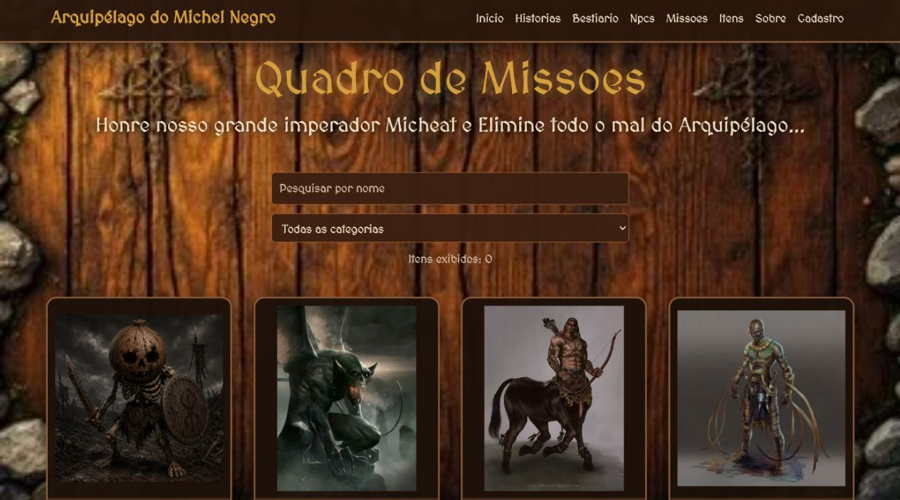
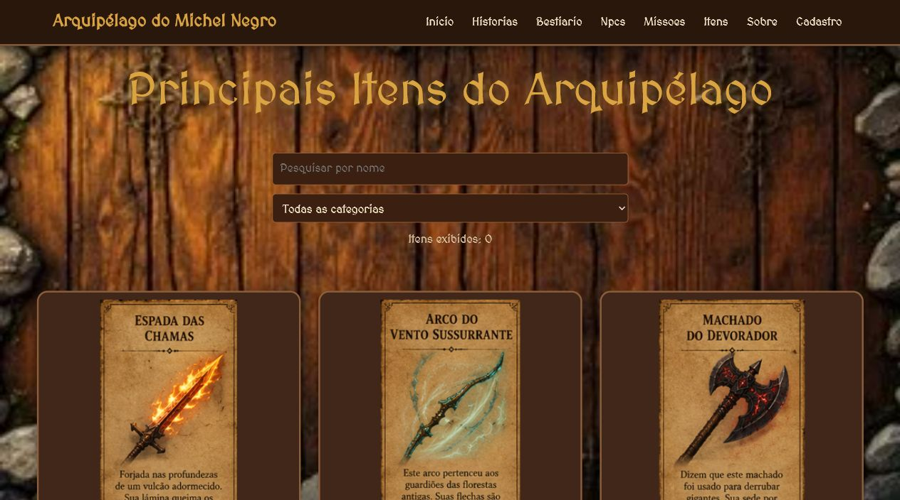
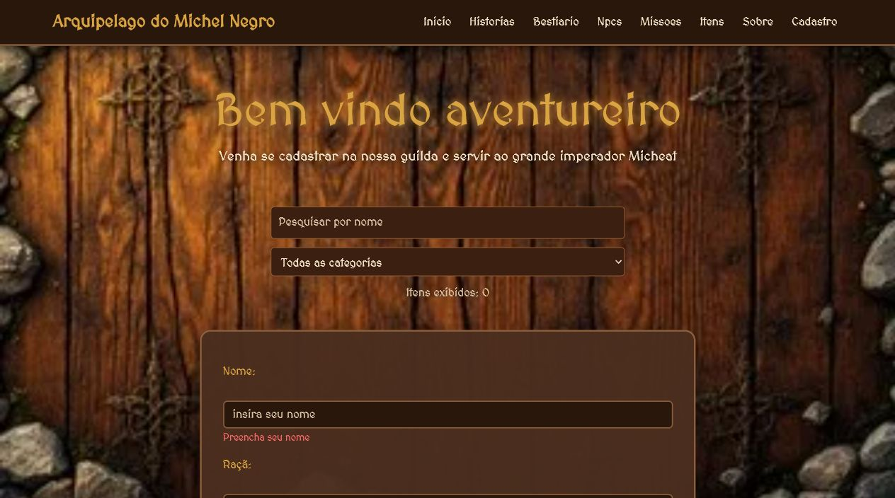

# Arquipélago do Michel Negro

O **Arquipélago do Michel Negro** é um site de RPG e fantasia que apresenta um universo fictício com histórias, monstros, NPCs, missões, itens e cadastro de aventureiros.

O projeto funciona como um catálogo interativo para explorar as principais informações desse mundo, reunindo conteúdos narrativos e páginas temáticas em uma experiência web feita com HTML, CSS, JavaScript e Bootstrap.

## Funcionalidades

- Página inicial com carrossel e atalhos para as seções principais.
- Sistema de pesquisa por nome, com filtro por categoria.
- Página de histórias do arquipélago.
- Bestiário com criaturas e inimigos do universo.
- Catálogo de NPCs.
- Lista de itens e equipamentos.
- Quadro de missões.
- Cadastro de personagens com distribuição de atributos.
- Salvamento de personagens e missões no navegador usando `localStorage`.

## Screenshots

### Página inicial


### Histórias



### Bestiário



### NPCs



### Missões



### Itens



### Cadastro



## Páginas do projeto

- `Html/index.html`: página inicial do site.
- `Html/Historias.html`: histórias e regiões do arquipélago.
- `Html/Bestiario.html`: criaturas e monstros.
- `Html/Npcs.html`: personagens do universo.
- `Html/Missoes.html`: quadro de missões.
- `Html/Itens.html`: itens, armas e equipamentos.
- `Html/Sobre.html`: informações sobre o projeto e os integrantes.
- `Html/Cadastro.html`: cadastro de aventureiros.

## Tecnologias utilizadas

- HTML5
- CSS3
- JavaScript
- Bootstrap
- GitHub

## Estrutura de pastas

```txt
Arquipalago-do-Michel-Negro/
|-- Css/
|-- Html/
|-- JavaScript/
|-- imagens/
`-- README.md
```

## Como executar o projeto

Como o site usa caminhos internos e busca arquivos HTML com JavaScript, o ideal é abrir o projeto usando um servidor local.

Uma opção é usar a extensão **Live Server** no Visual Studio Code.

Outra opção é abrir a pasta do projeto no terminal e executar:

```bash
python -m http.server 5500
```

Depois, acesse no navegador:

```txt
http://localhost:5500/Html/index.html
```

## Integrantes

- Augusto Cezar Morgenstern Schaefer
- Enzo Pietro Boeira
- Victor Vailões Smaniotto

## Repositório

[Arquipalago-do-Michel-Negro](https://github.com/Victor-V-Smaniotto/Arquipalago-do-Michel-Negro)
